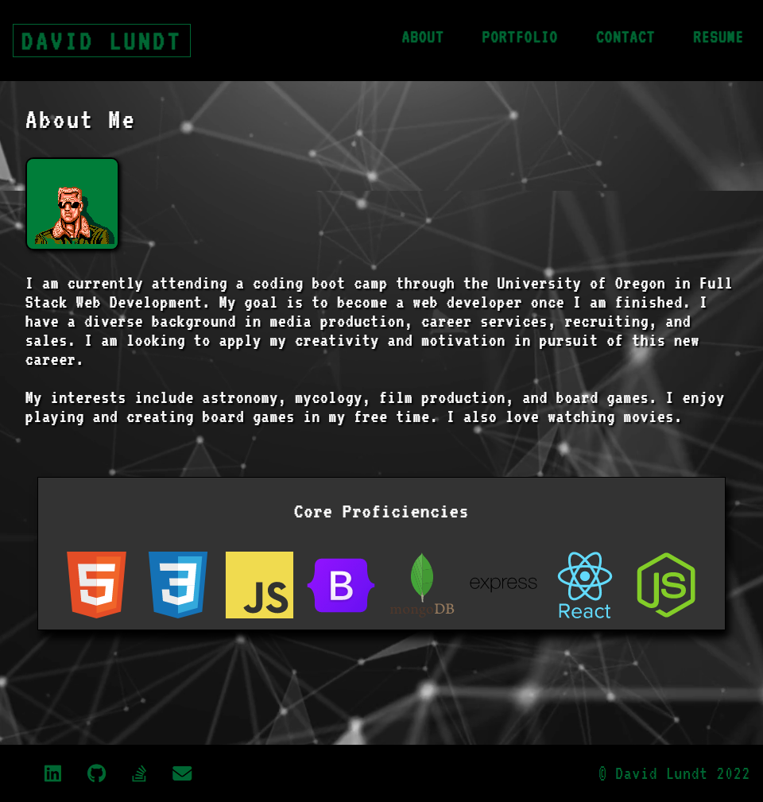

# [My React Portfolio](https://github.com/apatheticjedi/david-l-react-portfolio)

### Table of Contents

1. [Description](#description)
2. [Built With](#built-with)
3. [Installation](#installation)
4. [Usage](#usage)
5. [Acknowledgments](#acknowledgments)
6. [Questions](#questions)

## Description

This is a single-page application of my portfolio written in React. It uses conditional rendering to display 4 pages, including an About Me page, a Portfolio of projects I've worked on, a Contact page, and a Resume page. The footer contains links to my profiles and email. The Contact form does not currently have functionality.

### Built With

* JavaScript
* HTML
* CSS
* React 

## Installation

There is no installation required, as this page is currently hosted on GitHub pages as well as Netlify. You can view the hosted pages here: 

* [GitHub Page](https://apatheticjedi.github.io/david-l-react-portfolio/)
* [Netlify Link](https://davidlundt.netlify.app/)

(<a href="#top">back to top</a>)

## Usage

Click the links in the navbar at the top of the page to view each page. The contact me form has validation to ensure that each field has text entered and that the email address provided is a valid email. The form does not currently submit the information. Click the button on the resume page to view my full resume.

## Acknowledgments

* Netlify.com
* Pixabay.com (User: NewHumanDesigns)
* FontAwesome.com
* Devicon.dev

(<a href="#top">back to top</a>)

## Questions

Reach out to me with questions at:

[GitHub](https://github.com/apatheticjedi)

(<a href="#top">back to top</a>)

